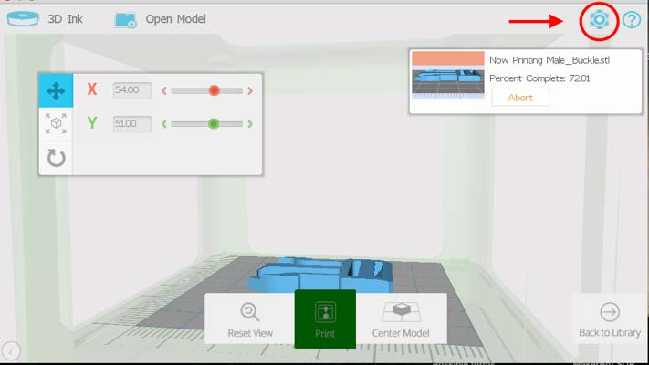
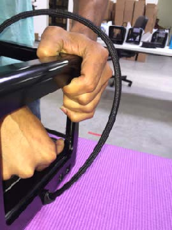
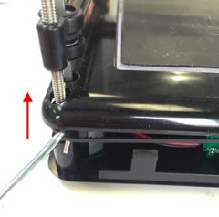
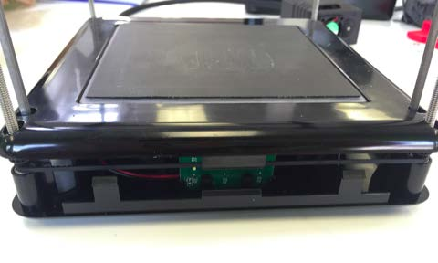
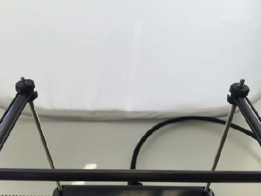
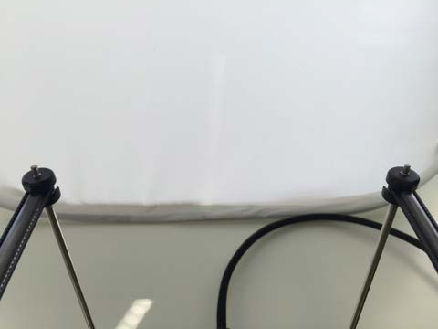
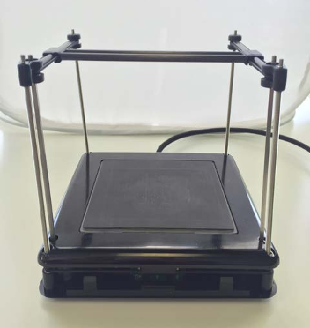

# Manually Level Gantries

If one or more of the gantries are not level with the others, here is a guide on how to manually level them.

1. One side of the x-rods will be glued to the sliders, one side will not.  **Hold** the slider in one hand, and the x-rack in the other.  
2. While holding the slider and X Rack, _gently_ **pull** apart from each other.  _Please **be careful** as to not bend the Z Rods, only a **small gap** is needed._  
3.  **Rotate** the slider so the pegs point upwards. The X Axis is now free from the sliders.    
4. **Take** the print head and begin to **slide** it off the x-rack towards the end that is free to remove from rack.  _Set print head aside_.         
5. With printer on and connected, click the gear in the upper right hand corner to access settings  
 

   

6. Navigate to the advanced settings tab and click the tab labeled "Expert Mode" 

   

7. The "Expert" window should now open and you will want to raise the z height by 50-100 using the Z Arrow buttons to get the gantries close to the top of the cube  
 

8. Unplug both usb and power cables from printer for next steps
9. Next, push down on a corner of the base and pull up on the same corner of the lid to remove the lid \(see picture below for technique\) Note: Take caution when pulling off lid. You do not want to pull the rods out from the base    
10. With the lid removed, you will see the z-belt running around the four pulleys on each threaded rod in the corners. Take a hook tool to grab the belt and slip it up or down off of the four pulleys \(see photos below\)  
 

         

11. Now with the belt off, you will be able to spin the threaded rods to move the gantries up or down. The best technique is to get the gantries all the way to the top of the rod where the top of the first thread is just showing \(see photos below\)  
 

    

    

12. You should now have the gantries looking like this  
 

    

13. Replace the belt on all four pulleys being careful not to spin the belt
14. Plug in the printer and connect to the spooler like before
15. You now want to move the gantries down a bit to replace the lid. Press -50 for the Z and quickly place pressure down on the four threaded rods to keep them from coming out of the pulleys while the gantries are moving down.  
 

    

16. Once the gantries are lowered, unplug the printer again and replace the lid. Carefully align the rods with their holes and press down to snap into place.
17. Replace the print head and recalibrate the bed location before printing

