# How To Guide: Micro fan replacement

First please disconnect the printer from power and USB when performing this replacement to prevent electric static discharge \(ESD\) damage to the printer. It is recommended you ground yourself before working. 

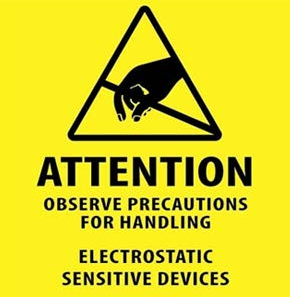

Remove print head from printer:

1. One side of the X Rods will be glued to the sliders, one side will not. Hold the slider in one hand, and the X Rack in the other.

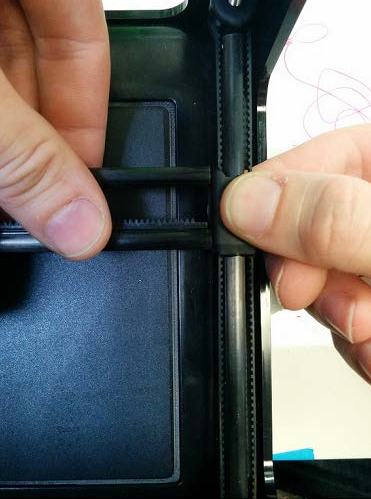

      2. While holding the slider and X Rack, gently pull apart from each other. Please be careful as to not bend the Z Rods, only a small gap is needed.

    3.  Rotate the slider so the pegs point upwards. The X Axis is now free from the sliders.

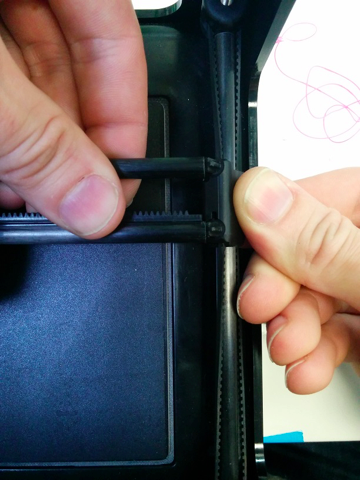

     4. Take the print head and begin sliding it off the x-rack towards the end that is free to remove from rack.

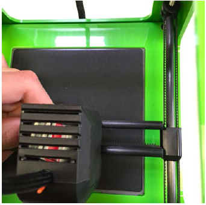

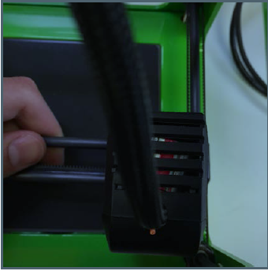

       5. Slide the extruder body off of the rods and place on your working surface.

Remove old fan:

1. Remove black front cover of the extruder body by pinching the sides and pulling from the top part of the cover.

       2. Locate the black and red fan cable assembly and carefully pull apart the connector without damaging the pins or wires. Check for wire or connector damages. If there are damages to the wire or connector, then your replacement fan may not work correctly.

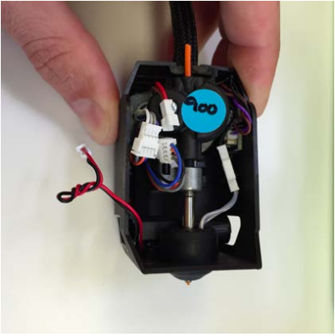

     3. Use a small prying tool \(small flat head screwdriver works well\) to carefully unseat the fan from the bottom of the extruder. There are two glue spots on two of the four corners of the fan. 

Note: Newer Micro and Micro+ printers will have the fan mounted internally and it can be removed by using the following steps.

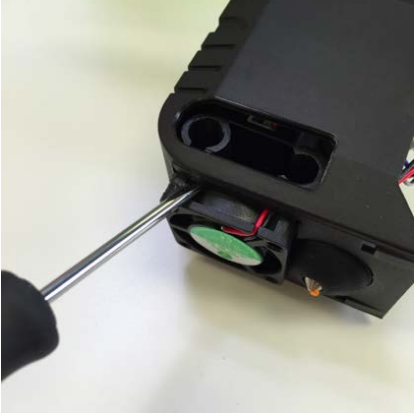

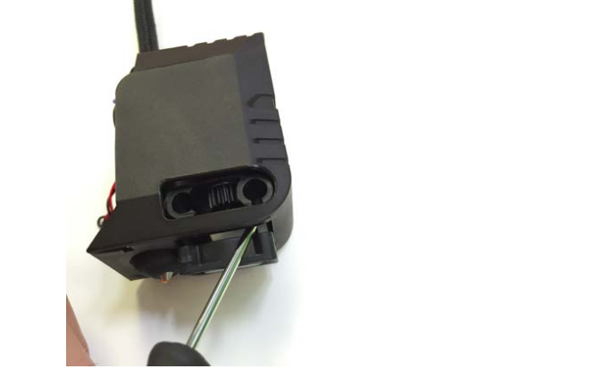

      4. Once the fan is loose, remove the fan and carefully pull out the red and black fan wires.

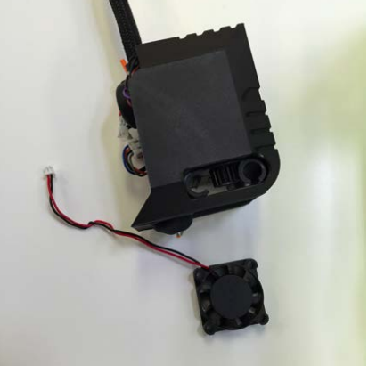

      5. Slide off black silicon heater cover from nozzle and heating unit.

      6. Use a 5mm socket wrench to remove the nozzle from the extruder core.

          Note: hold the heating element above the lower part of the nozzle to keep it from spinning with the nozzle while unscrewing the part. 

     7. Carefully remove micro motion chip by gently pulling it up.

     8. Pull out the extruder core keeping all wires connected.

    9. Remove X housing from print head. If the fan in your printer was mounted from the inside, you can now pull it out. 

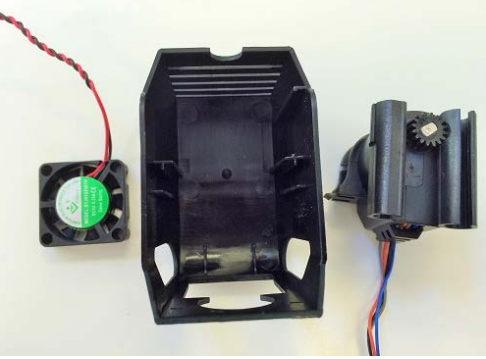

      10. Install new fan by dropping fan into the square opening of print bed housing. All fans should be mounted this way and not glued on                    from the outside.  
            Note: Fan label will face upwards inside the print head housing.

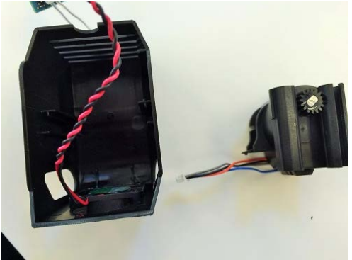

     11. Replace X housing.

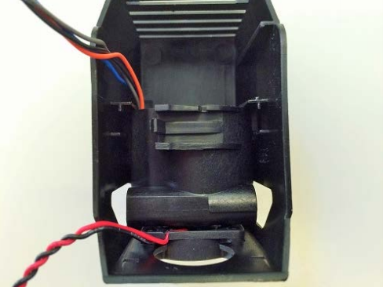

       12. Clip fan connector piece back into place matching the wire colors for both connectors.  
              WARNING: Be sure the wire does not come out of the wire connector. If this happens, then please try to lodge the wire back into the connector.

 13. Replace extruder core into extruder body

           Note: place cable assembly grommet on top of extruder core before placing extruder core back into extruder body \(see photo below\).

     14. Carefully slide micro motion chip back into place along the inside slot of the extruder body.

     15. Place nozzle and Teflon tubing through heating unit and screw nozzle back into the extruder core with the 5mm socket wrench.

      16. Tighten nozzle until 1 or 2 threads are showing below the metal housing.

      17. Slide heating unit down to the end of the nozzle.

      18. Replace black silicon heater cover over the nozzle and heating unit.

            Note: heating unit should be completely inside silicon cover. It may take some careful pressing with a small screwdriver to get the                      heating unit into the silicon \(see photo below\).

      Replace extruder into printer:

      1. Align carbon rods with holes of extruder and slide extruder onto rods.

      2. Align the carbon rods with the pegs of the slider and snap rods back into place.

Congratulations, you are done! We recommend doing a calibration before the next print job.

