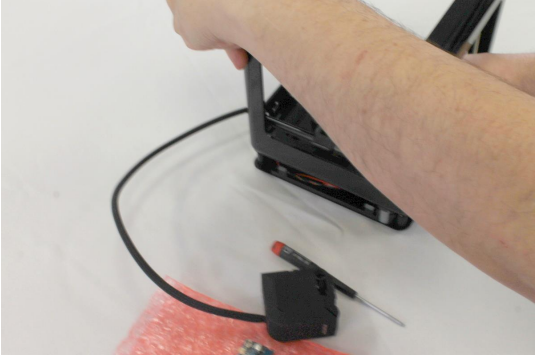
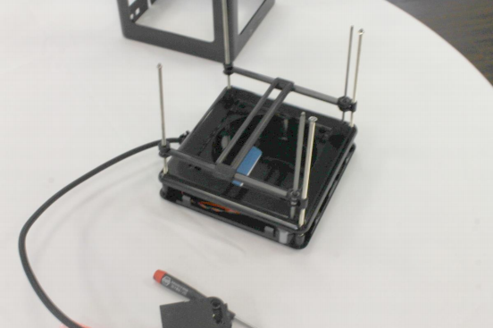
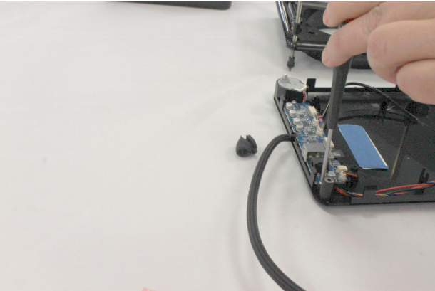
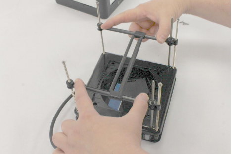

# How To Guide: Replace Micro+ PCB

In this guide we will explain how to replace the PCB for the M3D Micro+. You will need a T10 screwdriver and a hook tool \(for belts\) for the disassembly and you’ll want to be in an antistatic environment. Some electronics will be exposed during the disassembly and there is a chance you could damage them. We recommend not working on a carpeted area and to discharge before working. You can do this by touching something metal \(Not the printer\) for at least one second. Wearing an antistatic wrist-wrap would be good. Link for a wrist-wrap here htt[ps://www.amazon.com/](http://www.amazon.com/Rosewill-Anti-Static-Components-RTK-002-)R[osewill-Anti-Static-Components-RTK-002-](http://www.amazon.com/Rosewill-Anti-Static-Components-RTK-002-)Yellow/dp/B004N8ZQKY/ref=sr\_1\_1?ie=UTF8&qid=1494531998&sr=8-1- spons&keywords=anti+static+wrist+strap&psc=1 Although, it is highly recommended to use an antistatic wrist-wrap, if you do not have access to the antistatic wrist-wrap, you can do the repair process by having a metal contact to your body throughout the repair.

1. To remove the upper base \(fluff\) of the printer, you would need a T10 screw driver as shown in the picture below:

2. Next you would need to remove the print head \(extruder body\) by removing the X rod and rack from the right side. The left side is glues to the slider so you may not be able to remove the rod and rack from the left side. This is shown in the picture below:

Now remove the print head completely from the X rack and rod as shown in the pictures below:

3. Now you would need to remove the printer’s top frame \(also called top chassis\) as shown in the pictures below:

4. Once the top frame is removed, the printer should look like as shown in the picture below:

5. Now remove the four T10 screws that holds the upper base \(fluff\) to the lower base as shown in the picture below:

6. Next detach the fluff from the lower base by pulling it apart very carefully as shown in the pictures below:

7. Upper base \(fluff\), lower base and the Z belt and y belt once removed should have looked as shown in the picture below:

8. Next step is to remove the screw that holds the PCB onto the lower base as shown in the picture below:

9. Now remove all the cables from the PCB carefully one by one as shown in the picture below. After removing the old PCB, install the new PCB and then put all the cables back on.

10. Remove the lead screws from the gantries as shown in the picture below:

11. Once all the parts are removed, place the two pulleys on the front left and the back right corners. Make sure that the square pulley sits on the front left and the round pulley sits on the back right as shown in the picture below:

12. First, install the Y belt as shown in the picture below with the teethes inwards as shown in the picture below:

13. Now install the three lead screws and the square rod on the right side of the printer as shown in the picture below:

14. Now place the upper base \(fluff\) back on to the lower base as shown in the picture below:

15. Thread in the lead screw into the respective gantries as shown in the picture below:

16. Install the gantries on to the lead screws and the square rods on both the left and right side as shown in the pictures below:

17. The gantries after being installed should look like as shown in the picture below:

18. Next Install the left square rod as shown in the picture below:

19. This is how the printer should look like once the four threaded rods, tow square rods, and the left and right gantries are installed, as shown in the picture below:

20. Now install the Z belt by mounting it as shown in the pictures below:

21. Now connect the printer to the software and lower the Z axis down so that the top frame and be snapped in into place easily. The picture below shows the position of the gantries after moving them down in the Z axis.

22. Install the grommet at the back of the printer as shown in the picture below:

23. Finally install the top frame and make sure that all the top of the rods snap into the correct holes in the top frame as shown in the picture below:

 Updated: Mar 30 \(4 months a

