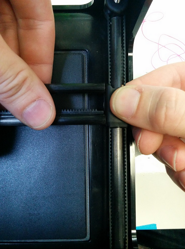

# How to Guide: Replace Z Belt

If your Z-belt is broken or needs replacing, here is a guide on how to swap out the belt.

  
1. One side of the x-rods will be glued to the sliders, one side will not.  
Hold the slider in one hand, and the x-rack in the other.

2. While holding the slider and X Rack, gently pull apart from each other.  
Please be careful as to not bend the Z Rods, only a small gap is needed.

3. Rotate the slider so the pegs point upwards. The X Axis is now free from the sliders.

4. Take the print head and begin to slide it off the x-rack towards the end that is free to  
remove from rack.  
Set print head aside.

5. Next, push down on a corner of the base and pull up on the same corner of the lid to  
remove the lid \(see picture below for technique\)

6. With the lid removed, you will see the z-belt running around the four pulleys on each  
threaded rod in the corners. Take a hook tool to grab the belt and slip it up and over the  
plastic base of the printer.

7. Pull the belt up and over the other corners of the printer and remove

8. Take new belt and put it around all four threaded rods.

9. Pull down the belt around the plastic edges of the printer and replace belt on all four  
pulleys.

10. Double check belt is not flipped upside down  
11. Take lid and replace it, aligning all rods into their respective holes  
12. Replace print head onto the x-rack  
13. Your printer is now ready for use again  
14. Please recalibrate the bed location before printing

