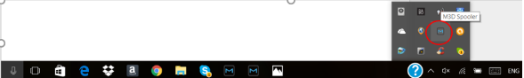
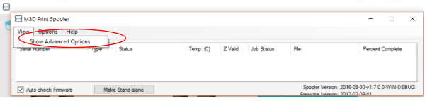
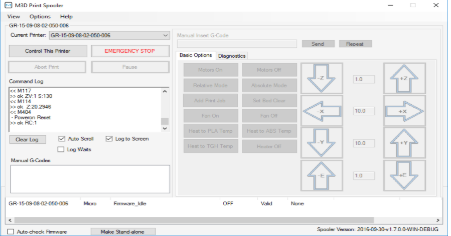
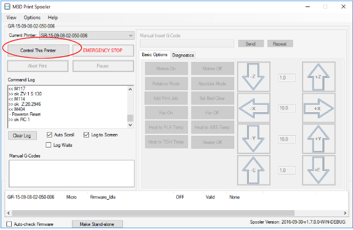
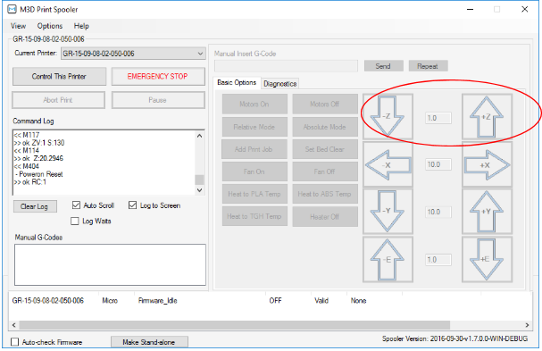
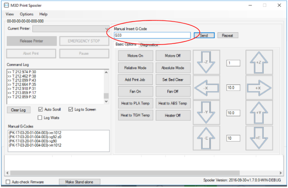
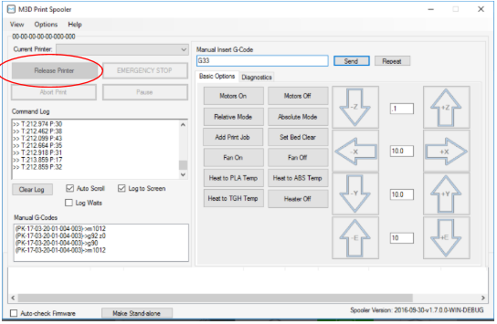

# Manual Calibration Guide

**STEPS TO CALIBRATE THE NOZZLE TIP FOR THE M3D Micro/Micro+/PRO**

1. Go the M3D PRO software spooler. You can get access to the spooler by going to the “Show Hidden Icons” on the bottom right corner of your computer screen that has a symbol “^” \(Figure 1\).

Figure 1: Access to M3D PRO spooler

1. Once into the spooler, click on view and then click on Show Advanced Option \(figure 2\).

Figure 2: Advanced Options for the M3D PRO Spooler

The following window will open \(figure 3\):  
 

Figure 3: Spooler window showing all the advanced options

1. Now click on Control This Printer tab to control the printer using the spooler so that you can heat the extruder, lower the nozzle, move the printer in X and Y axis, etc \(figure 4\). Type in the G-code G28 to move the print nozzle to the center of the print bed.

Figure 4: Spooler window showing the “Control This Printer” tab

1. Take a small piece of A4 size paper \(100 microns\), figure 5 and slide it under the nozzle.

Figure 5: Small A4 size paper \(100 microns\) – A sticky note sheet  
 

1. Lower the Z by clicking on -Z such that the A4 size paper just scraps the nozzle tip when moved between the nozzle tip and the print bed. If the paper is too tight to slide in, raise the nozzle. If the paper slides easily without any scarp with the tip feel, then lower the nozzle. You may want move Z by 0.1, 1 or 10 units based on the situation and your judgement \(figure 6\).  NOTE: While lowering the Z, the system might prevent you from lowering the Z-axis any further. In such case, enter the G-code M1012 in the manual insert G-code tab and you should be able to move the Z-axis further down.

Figure 6: Spooler window showing the +Z and -Z tab to lower or raise the print head/nozzle

1. Once the nozzle tip is at the correct height \(paper scrapping the nozzle tip\), type in the G-code G33 in the manual insert G-code tab and click on send. This will store the offset values for all the corners in the system \(figure 7\) – Next Page.

Figure 7: Spooler window showing how to enter the manual insert code such as G33 to store the offset values

 7.  To get access to the functions using the GUI, click on the Release Printer tab \(figure 8\).

Figure 8: Spooler window showing how to release the printer from spooler so that the printer can be controlled by the GUI

