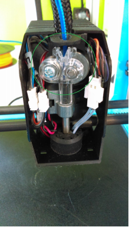
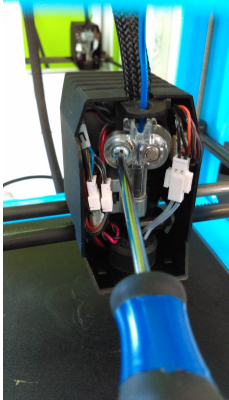
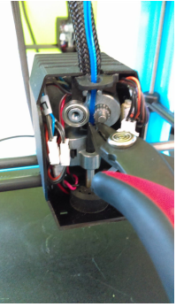
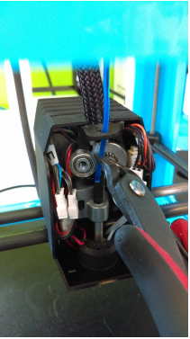

# Removing Stuck Filament

If your filament is loaded in between the extruder gear and you can’t remove it with the standard method in our software then you might need to open the extruder up to cut the filament out. Below our step by step instructions for removing said stuck filament.

1. Remove the front extruder cover to gain access to the inside of your extruder.

2. Once the cover is removed located the clear gear cover inside.

3. After you have located the gear us a phillips screwdriver to remove the cover.

4. Next us a pair of cutters to cut the filament right underneath the gear \(be careful not to cut the small black tube poking out of the nozzle.

5. After cutting the filament you can use the cutters to pull the filament out from the gear and bearing. This should now allow you to remove the rest of the filament.

6. Once the filament is removed you can place the clear gear cover back on and screw it back in place. When screwing it back in place make sure not to screw it in too tight. Doing so can cause extrusion issues. We recommend screwing it in all the way and then doing a half turn back. This should allow the gear cover to stay in place without causing issues.

