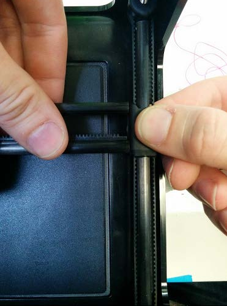
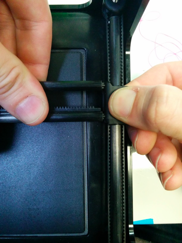

# Replacing and gluing X-gear

First of all, please disconnect the printer from power and USB when performing this replacement to prevent electric static discharge \(ESD\) damage to the printer. It is recommended you ground yourself before working. 

1. One side of the X Rods will be glued to the sliders, one side will not. Hold the slider in one hand, and the X Rack in the other.

   

2. While holding the slider and X Rack, gently pull apart from each other. Please be careful as to not bend the Z Rods, only a small gap is needed.  
 

   

3.  Rotate the slider so the pegs point upwards. The X Axis is now free from the sliders.    
 

   

4. Slide the print head off of the rods and place on your working surface

5. While holding print head, replace X-gear into it's normal position with either a flat head screw driver or another tool

6. Then with a small applicator, place a small drop of super glue at the cent of the gear where the metal motor shaft is visible.

7. Allow the glue to fully dry and then replace the print head repeating the steps above in the reverse order

