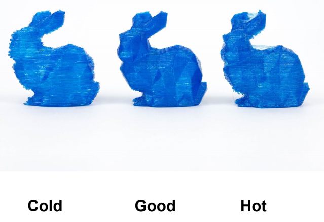
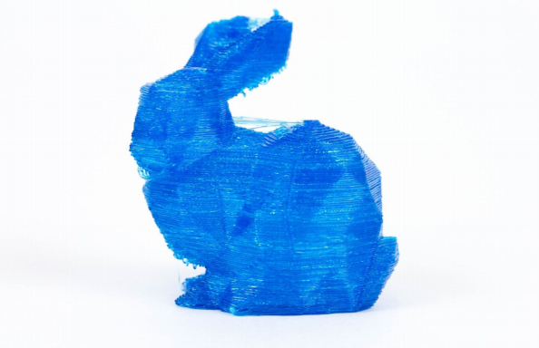
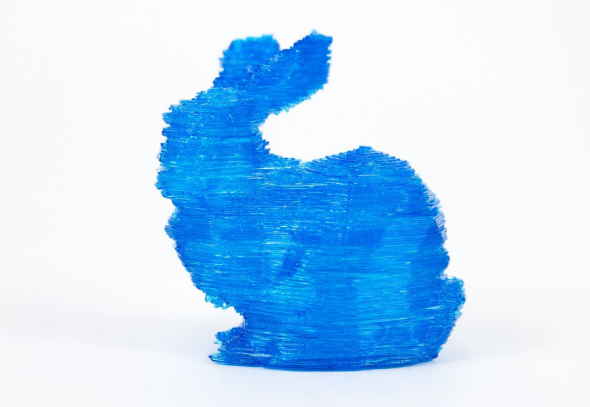
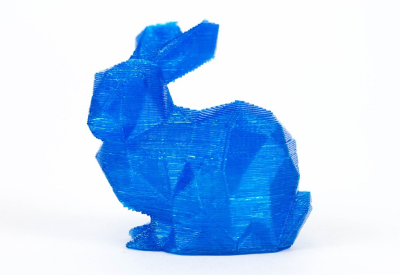

# Troubleshooting Temperature Issues

Your prints could be failing due to being cold or too hot. It can be hard to tell sometimes weather it’s too cold or hot and we have provided some pictures below to show you the difference.

**HOT**

As you can see in the photo above hot prints turn out stringy. You will want to lower temperatures to correct this.

\*When adjusting temperatures we recommend starting with a 10 degree jump and then working in increments of 5 if needed\*

**COLD**

Cold prints do not bond well and will lift off the print bed. They are also quite brittle. You will want to increase temperatures to correct this.

\*When adjusting temperatures we recommend starting with a 10 degree jump and then working in increments of 5 if needed\*

**GOOD**

Layers have bonded well with no strings. No adjustment should be required.

